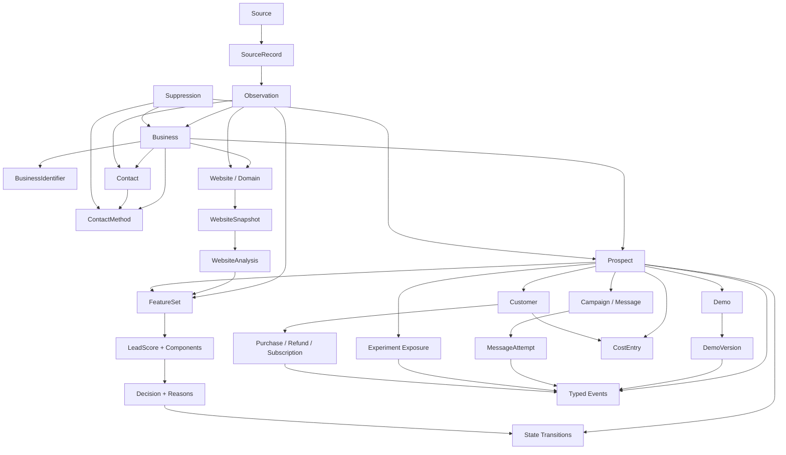

# ADR-004 — Core Data, CRM & Event Architecture

- **Status:** Accepted
- **Date:** 2026-08-26

## Context

SaltBox needs one coherent data foundation for discovery, enrichment, website analysis, scoring, demos, outreach, sales, customers, experiments, costs, and learning. Operational work needs a fast answer to what is true now: who a business is, whether outreach is allowed, which prospect state is current, and which work is pending. ADR-002 also requires the evidence that explains what SaltBox knew, decided, showed, spent, and later observed.

Neither current-state-only CRUD nor full event sourcing fits both needs. Current-state-only records overwrite evidence and make historical decisions impossible to reproduce. Full event sourcing would make ordinary CRM operations, corrections, and reporting more complex than SaltBox's present scale warrants.

This ADR defines the logical model and invariants before selecting a persistence technology. Names below describe domain concepts, not database tables or deployment boundaries.

## Decision summary

SaltBox will use a **relational, authoritative current-state model plus append-oriented observations, versions, decisions, transitions, events, and ledger entries**.

- Current-state records are authoritative for identity, resolved facts, workflow state, eligibility, and the latest usable artifacts.
- External facts remain attributable observations. Resolution selects a current value without erasing conflicting or older evidence.
- Immutable or append-oriented feature snapshots, scores, decisions, experiment exposures, transitions, events, message attempts, costs, and commercial records preserve history.
- A shared, typed, versioned event envelope carries domain, analytics, and audit categories. It is not the sole source of truth for entity state.
- Prospect lifecycle state is a small acquisition-workflow state machine. Engagement events, task status, demo status, suppression, and customer fulfillment have their own meanings and do not inflate that state machine.
- Important actions are idempotent, correlated, attributable, and protected by constraints and concurrency control.
- Learning datasets are assembled point in time from feature snapshots and observations available no later than the historical decision; labels are derived later from authoritative outcome events.

Database provider, ORM, physical schema, API shape, queue, event transport, analytics engine, object storage, and billing provider remain undecided for ADR-005 or later implementation decisions.

## Architectural pattern

The system separates four complementary record roles:

| Role | Purpose | Mutation model | Examples |
| --- | --- | --- | --- |
| Authoritative current state | Efficiently coordinate work and answer what SaltBox believes now | Validated updates with concurrency control | Business canonical name, current prospect state, active suppression, primary website |
| Historical evidence | Preserve what a source or measurement reported at a time | Append; corrections supersede rather than rewrite evidence | Observation, website snapshot, analysis, feature set |
| Decisions and actions | Preserve why SaltBox or an operator acted | Append; never replaced by the latest result | Lead score, decision, state transition, message attempt, experiment exposure |
| Outcomes and economics | Preserve what happened and what it cost or earned | Append, with explicit reversals/corrections | Engagement event, cost entry, purchase, refund |

Current state may be rebuilt or reconciled from authoritative history where practical, but SaltBox will not require event replay to load a business or operate the CRM. Conversely, mutable current rows must not be treated as adequate historical evidence.

## Identity and relationship boundaries

### Business

A `Business` represents a real-world organization SaltBox has identified. It owns canonical, resolved current facts while observations retain competing source claims. A business exists independently of whether SaltBox chooses to sell to it.

A business may have multiple locations, domains, websites, contacts, source records, prospecting cycles, and commercial relationships. A separately operated location may be modeled as a distinct business only when SaltBox can justify that sales and identity boundary; otherwise location is subordinate business data. Parent/branch relationships may be added without collapsing organizations into one record.

### Prospect

A `Prospect` represents one bounded SaltBox acquisition relationship or sales pursuit involving a business. It owns lifecycle state, qualification history, demos, outreach, experiment exposure, and acquisition costs for that pursuit.

A business may have multiple prospects over time—for example, after a long-closed pursuit is reconsidered under new evidence—but SaltBox should normally allow only one active acquisition pursuit for the same business and market/offer scope. Starting a later prospect does not erase the earlier one.

### Customer

A `Customer` represents a converted commercial relationship. It references the business and, when applicable, the originating prospect. Conversion creates a customer record; it does not turn the prospect row into a customer or delete prospect history.

A business may have more than one customer relationship over time if contracts or service relationships are materially separate. Whether the initial implementation restricts a business to one active customer account is a physical-schema decision, but duplicate active accounts must not arise accidentally.

### Contact and contact method

A `Contact` represents a person or known business role associated with a business. It must not imply owner or decision-maker status unless that relationship is known and sourced. Multiple contacts can belong to one business, and a person may have a time-bounded role.

A `ContactMethod` represents a reachable endpoint such as email, phone, contact form, or social profile. Every method belongs to a business and may optionally be attributed to a contact. This supports general inboxes and switchboards without inventing a person. It records normalized value, display value, channel, source/provenance, validation status, confidence band, last validation time, delivery health, and suppression references.

The same normalized method rediscovered from another source should attach new provenance to the existing method instead of creating an outreach-eligible duplicate.

### Recommended cardinalities

- Business `1 → many` BusinessIdentifier, Observation, Contact, ContactMethod, Website association, Prospect, and Customer.
- Source `1 → many` SourceRecord. A SourceRecord may remain unlinked, support one resolved Business, or participate in multiple entity-match candidates until resolution.
- Contact `0..1 → many` ContactMethod; every ContactMethod still has one Business scope.
- Business `many ↔ many` Domain/Website is allowed conceptually because shared brands, franchise pages, and redirects exist; an association can carry `primary`, relationship type, and validity dates.
- Prospect belongs to exactly one Business. A Customer belongs to exactly one Business and may reference one originating Prospect.
- Prospect `1 → many` FeatureSet, LeadScore, Decision, state transition, Demo, Message, Event, exposure, and CostEntry.

## Identifiers

Internal identifiers must be opaque, immutable, globally unique enough for safe distributed creation, and independent of external-provider identifiers. UUID- or ULID-style identifiers are suitable candidate families; ADR-005 may evaluate storage and indexing tradeoffs without requiring a database extension.

External identifiers belong in `BusinessIdentifier` or `SourceRecord`, namespaced by provider, dataset/account, identifier type, and applicable validity. Normalized domains, phones, and emails can also act as matching signals but are not universal business identity keys.

Public demo URLs use a separate opaque, revocable public locator or signed token. They never expose a raw business, prospect, or demo internal identifier.

## Discovery, provenance, and entity resolution

### Source, source record, and observation

`Source` describes origin and acquisition context: manual entry, directory, map dataset, registry, search provider, website crawl, social profile, webhook, or future provider. It includes source type and policy/retention metadata; it is not one row per fetch.

`SourceRecord` represents one provider record or retrieval unit. Its identity is unique within its source namespace and may preserve retrieval status, retrieval time, source URL or locator, content hash, raw-evidence reference, and provider metadata needed to interpret it.

`Observation` is an append-oriented, typed claim about a defined subject and field at a point in time. It includes:

- subject kind and internal subject reference;
- observation type/field definition and schema version;
- typed normalized value and unit where applicable;
- Source and optional SourceRecord reference;
- `observed_at`, `recorded_at`, and when distinct `retrieved_at`;
- confidence band, verification method, and freshness/expiry metadata;
- raw evidence reference, summary, or hash when retained;
- supersession or correction reference when an ingestion error is corrected.

The future physical model must use constrained subject and value types rather than allowing arbitrary strings to masquerade as typed observations.

`observed_at` is when the fact was true or measured according to its source. `retrieved_at` is when SaltBox obtained the source payload. `recorded_at` is when SaltBox durably accepted the observation. They may differ, especially for historical registries, delayed webhooks, and imports.

### Entity-resolution workflow

Entity resolution is evidence-based and reversible:

1. Normalize safe comparison signals such as business name, domain, phone, email, postal address, coordinates, provider ID, and social profile.
2. Use exact high-quality identifiers first; later matching logic may produce an `EntityMatchCandidate` with signal-level evidence and a confidence band.
3. Auto-link only under an explicitly versioned, conservative policy with sufficient high-confidence evidence.
4. Route uncertain candidates to manual review. Uncertainty must never cause a silent merge.
5. Record a confirmed merge or rejected match with actor, reason, resolution policy version, timestamp, and candidate evidence.

No fuzzy algorithm or threshold is selected here. Confidence uses understandable bands—`verified`, `high`, `medium`, `low`, `unknown`—plus the evidence supporting the band. Numeric values are acceptable only when produced by a calibrated matching model with a documented meaning; cosmetic decimal precision is prohibited.

### Conflicts and resolved current values

Source disagreement creates multiple observations; it does not overwrite evidence. A resolution policy selects the current value using verification status, source authority for that field, recency, agreement, and operator overrides. The resolved current field records which observation or override supports it.

For example, conflicting phones remain visible as observations while one validated phone may become the current primary ContactMethod. An operator correction has explicit precedence until revoked or expired and does not delete the source claims it overrides.

### Merge and deletion semantics

A confirmed business merge selects a surviving canonical Business and records aliases/tombstones from merged identities. Source records, observations, contacts, methods, websites, prospects, decisions, events, demos, exposures, costs, and customers are re-associated or resolved without physical loss. Public references and idempotency keys remain stable. The merge record is attributable and reversible through a controlled repair process; routine code must not hard-delete the losing history.

Archiving removes an entity from ordinary operations without erasing evidence. Destructive deletion is reserved for approved privacy, security, or data-quality workflows and must cascade or anonymize intentionally while retaining the minimum non-contact suppression proof needed to prevent accidental re-contact where policy permits. Exact deletion behavior and retention periods remain policy decisions.

## Raw, normalized, and derived data

SaltBox preserves the smallest evidence sufficient for operation, explanation, and reproducibility:

1. **Raw evidence** is the provider payload, page artifact, or capture from which facts were extracted.
2. **Normalized observations** retain durable, typed facts such as `review_count = 137`, `reviews_last_90_days = 18`, and `rating = 4.7`, each with time and provenance.
3. **Derived features** retain reproducible inputs such as `activity_score = 86` and the derivation version that produced them.

Raw evidence is retained when it is hard to reacquire, necessary to explain a material decision, permitted by source terms, proportionate to privacy risk, and economical to store. It may instead be:

- summarized into durable typed observations;
- content-hashed to prove the processed input without retaining it;
- referenced in short-lived object storage;
- redacted to the minimum necessary fields; or
- expired under a source-specific retention class.

SaltBox must not retain massive crawl/provider payloads indefinitely by default, and it must never preserve only an opaque score when useful source measurements can be normalized. Hashes establish identity/integrity, not the content needed for later reprocessing.

## Website model

- `Domain` is a normalized DNS/host identity with registration/availability observations and redirect relationships. A domain is not itself a business or website.
- `Website` is the logical web presence associated with one or more domains and businesses. It carries resolved current canonical URL and operational status.
- `WebsiteSnapshot` is an immutable capture manifest for a website at a time: requested/final URL, crawl scope, HTTP/HTTPS and redirect results, content/evidence references, hash, observed time, and capture/tool version. Large assets follow retention policy.
- `WebsiteAnalysis` is a versioned result derived from one or more snapshots. It preserves analyzer version, inputs, calculated time, structured findings, confidence/validation, and lineage to observations or artifacts.

Analyses may cover responsiveness, performance, accessibility, SEO fundamentals, broken links, forms, CTAs, metadata, schema markup, social links, technology fingerprints, copyright year, and visual-age indicators. Stable common findings should use typed fields or registered finding codes; bounded supporting details may use schema-validated properties. SaltBox can reanalyze the same snapshot with a newer analyzer without pretending the website itself changed.

## Feature, score, and decision architecture

The learning lineage is:

```text
SourceRecord / WebsiteSnapshot
              ↓
        typed Observation
              ↓
 immutable FeatureSet + lineage
              ↓
       versioned LeadScore
              ↓
      first-class Decision
              ↓
       Action and outcome Event
```

### Feature sets

A `FeatureSet` is an immutable, point-in-time input snapshot for one prospect and one feature-schema version. It records `as_of`, calculation time, feature-definition version, producing pipeline version, and links to the observations, website analyses, or prior permitted facts used.

The initial feature contract should define stable typed fields for common signals such as review counts, website performance, mobile pass, email availability, business category, and ad-activity signal. Related fields may be grouped into explicit versioned structures for need, value, activity, and reachability.

New or experimental features may use a `FeatureDefinition` registry and typed extension records with name, data type, unit, semantic description, valid domain, owner, and version. This is a controlled extension mechanism, not arbitrary JSON and not a universal Entity-Attribute-Value model. Frequently queried or operationally important features should graduate into the stable feature contract. JSON is permitted only for bounded, schema-versioned supporting structures, never as an ungoverned feature bag.

Feature lineage must identify the observation or analysis version and transformation that produced each material feature. Derived features never replace their raw normalized inputs.

### Lead scores

`ScoringVersion` identifies an immutable scoring/rule/model definition, including input feature schema, code/configuration artifact version, and activation interval. Weights are intentionally not defined here.

A `LeadScore` is an immutable evaluation of one FeatureSet under one ScoringVersion. It records overall result, calculated time, validation status, and the four conceptual dimensions `NEED`, `VALUE`, `ACTIVITY`, and `REACHABILITY` where applicable.

`ScoreComponent` records dimension/component result, contributing feature references, direction/importance or rule outcome, and structured reason codes. It preserves enough information to explain “why 84” without requiring private model reasoning.

Historical rescoring creates another LeadScore referencing the same historical FeatureSet and a new ScoringVersion. It never edits the original score. This makes “what would this prospect have scored under scoring-v5?” distinct from “what did SaltBox score at the time?”

### Decisions and reasons

A `Decision` is separate from both LeadScore and lifecycle state. Decision types include qualify/reject, generate/skip demo, send/suppress outreach, allow/deny paid AI, and escalate/continue automation. Each decision records:

- type, structured result, and `decided_at`;
- subject and optional action being authorized;
- input FeatureSet, snapshots/analyses, and LeadScore where applicable;
- immutable rule/model/policy version;
- actor type and actor reference;
- confidence band where meaningful;
- correlation/run identifiers; and
- one or more `DecisionReason` records.

`DecisionReason` uses a registered machine-readable code, optional feature/evidence reference, contribution/direction, and optional concise human explanation. Acceptable reasons resemble `website.mobile_layout_missing`, `business.reviews_recent_high`, and `contact.email_validated`; “AI thought this looked good” is not sufficient.

Actors include deterministic system, worker, local model, paid model, human operator, and external webhook. Model metadata records provider/classification, model version, prompt/instruction version, and structured result where needed, but never hidden chain-of-thought.

## CRM lifecycle

The Prospect lifecycle expresses acquisition workflow ownership, not every observed fact or worker status. The proposed states are:

```text
discovered
    ↓
enriching
    ↓
evaluated ─────────────→ rejected
    ↓
qualified
    ↓
outreach_active
    ↓
engaged
    ↓
sales_active ──────────→ lost
    ↓
won

Any nonterminal state ─→ paused
```

- `discovered`: a prospecting cycle exists but evidence is minimal.
- `enriching`: acquisition/enrichment work is intentionally underway.
- `evaluated`: sufficient current analysis exists for a qualification decision.
- `qualified` / `rejected`: a decision authorized or declined pursuit.
- `outreach_active`: a campaign/sequence is active or ready under current eligibility.
- `engaged`: meaningful inbound interest requires a different workflow; a mere view need not cause this transition.
- `sales_active`: an active sales conversation is being managed.
- `won` / `lost`: the acquisition pursuit ended with or without a commercial conversion.
- `paused`: work is intentionally suspended and may resume through a controlled transition.

Demo queue/generation/readiness belongs to Demo or job status. Email delivery, demo views, clicks, replies, and purchases are events. Suppression is an independent safety control. Customer production, review, deployment, active, and churn status belongs to the Customer/service domain. Excluding those concerns prevents lifecycle state explosion.

### Transitions

Only a Prospect domain service may change lifecycle state. It validates:

```text
current state + allowed transition + prerequisites/trigger = next state
```

Every successful transition appends a `ProspectStateTransition` containing from/to state, occurrence time, trigger/decision reference, reason code and explanation, actor, correlation ID, and the expected prior record version. Invalid or stale transitions fail rather than silently assigning state.

Operator overrides use the same transition path, identify the operator and reason, and preserve the automation decision they supersede. A long-closed pursuit normally remains closed; a genuinely new pursuit creates a new Prospect linked to the same Business.

The analytical funnel is derived from earliest qualifying state transitions and authoritative events. It is never maintained as a second mutable funnel-state field. For example, `outreach_active` can coexist with `email_delivered` and `demo_view` events; the funnel derives OUTREACH DELIVERED and DEMO VIEWED from those events without mutating the lifecycle merely for measurement.

## Demo architecture

- `DemoTemplate` is a reusable renderer/template identity with immutable template versions.
- `Demo` is the logical sales artifact for one Prospect and has current status, public-locator policy, and archive/expiration state.
- `DemoVersion` is an immutable revision referencing exactly one Demo, one structured business-data/FeatureSet or content-input version, one template version, generated-content version, generator/model metadata where used, creation time, publication time, and artifact/content hash.

A Prospect may have multiple Demos when campaigns or concepts materially differ, and each Demo may have multiple versions. Publication identifies the exact version a visitor could see; engagement events reference the actual DemoVersion. SaltBox deploys one reusable renderer plus structured versioned data, not one application or codebase per prospect.

## Outreach and communication

### Campaigns, sequences, and messages

- `OutreachCampaign` describes a bounded strategy, audience, offer, and policy/version context.
- `OutreachSequence` has immutable versions defining ordered message intents and delays. A campaign enrollment links a Prospect to the sequence version actually used.
- `Message` is the intended immutable inbound or outbound communication: channel, direction, business/prospect/contact context, campaign/sequence step, content/template/version, conversation, scheduled time, and idempotency key.
- `MessageAttempt` is one provider delivery attempt for a Message, including attempt number, provider/request identity, queued/sent time, result, failure class, delivery/bounce/complaint updates, and cost reference.

The Message separates intent from transport attempts. A retry adds an attempt; it does not clone the intended message. Provider webhooks update attempt outcome through idempotent event processing. A unique operation key prevents more than one accepted successful send for the same message intent even if workers or callbacks repeat.

### Conversations

A lightweight `Conversation` groups related inbound and outbound Messages by channel or provider thread. It references the Business and may reference a Prospect, Customer, and primary Contact. Messages retain provider message/thread IDs as external identifiers.

This supports future sales or support threading without building a support platform. Conversation membership cannot be inferred solely from email subject text, and a customer conversation does not erase its originating prospect context.

### Suppression and outreach safety

`Suppression` is authoritative safety state independent of Prospect lifecycle and campaigns. It records scope (global, business, contact, contact method, channel, or address/domain where policy permits), type, status, source/evidence, reason, effective time, optional expiry, actor, and created/revoked audit references.

Supported reason types include unsubscribe, do-not-contact, complaint, hard bounce, invalid contact, and operator suppression. Hard suppressions survive rediscovery, business merge, a new Prospect, contact re-import, and campaign enrollment. Eligibility is computed only after checking all applicable scopes; positive eligibility never overrides an active stronger suppression.

Suppression removal is a separately authorized, audited decision and cannot destroy the original record. The ADR establishes enforcement capability but makes no legal conclusion or compliance rule.

## Canonical event architecture

SaltBox uses one shared event infrastructure with explicit categories rather than three disconnected pipelines:

- **Domain events** record business-significant facts such as `ProspectQualified`, `DemoPublished`, `CustomerWon`, `SubscriptionStarted`, and `RefundRecorded`.
- **Analytics events** record behavior such as `demo_view`, `demo_engaged`, `demo_cta_click`, `landing_view`, `pricing_view`, and `contact_submitted`.
- **Audit events** record attributable actions or sensitive changes such as `operator_override`, `lead_score_recalculated`, `business_merged`, and `suppression_removed`.

All use a common `Event` envelope:

- immutable event ID, category, registered type, and schema version;
- `occurred_at` and `recorded_at`;
- business plus optional prospect, customer, contact, demo version, message, campaign, and purchase context;
- source/producer and actor;
- correlation, causation, run/job, and external-provider references;
- idempotency key;
- experiment exposure context where relevant; and
- small schema-validated properties specific to the event type.

An event registry defines owner, semantic meaning, required context, property schema, privacy class, and compatibility policy for every event type. Event payloads are bounded and versioned; unknown arbitrary keys are rejected or quarantined. Stable high-value context belongs in indexed envelope fields, not buried in properties.

The initial registry should cover, without implying a table per type:

- outreach: `email_queued`, `email_sent`, `email_delivered`, `email_bounced`, `email_complaint`, and `unsubscribe`;
- demo/public behavior: `demo_view`, `demo_engaged`, `demo_cta_click`, `landing_view`, `pricing_view`, `contact_started`, and `contact_submitted`;
- conversation: `reply_received`, `positive_reply`, and `negative_reply`;
- commercial: `checkout_started`, `purchase`, `refund`, `subscription_started`, and `subscription_cancelled`; and
- domain/audit counterparts for material state changes and operator/system actions.

Names are canonical semantic contracts, not provider webhook names. Provider-specific statuses are normalized only after their evidence is retained.

The event store does not replace current entity records, MessageAttempt delivery truth, Suppression, purchase/refund records, or the lifecycle transition log. Those authoritative records may emit corresponding events in the same transaction. Analytics projections may be rebuilt from canonical events, but third-party analytics is never SaltBox's sole learning store.

### Event and action idempotency

At-least-once delivery is assumed. Producers assign a stable idempotency key for the logical operation before executing it. The authoritative store enforces uniqueness at the narrowest correct scope—for example:

- producer/source plus provider webhook event ID;
- action type plus target plus operation key for demo generation;
- Message plus logical send key for outreach;
- billing provider plus payment/refund event ID; and
- experiment plus subject plus assignment version where assignment must be stable.

Consumers keep an inbox/processing receipt or equivalent unique claim when side effects cannot be committed atomically with event consumption. Duplicate delivery returns the recorded result or becomes a no-op; it never repeats an external side effect merely because a retry occurred.

## Time semantics and freshness

All authoritative timestamps use an unambiguous timezone-aware representation, normally UTC. Business-local timezone is a separate IANA timezone value when needed for opening hours, send windows, reporting, or interpretation of source-local dates.

| Timestamp | Meaning |
| --- | --- |
| `occurred_at` | When a domain, analytics, audit, cost, or commercial event actually happened |
| `observed_at` | When an externally derived fact was true or measured according to available evidence |
| `retrieved_at` | When SaltBox fetched or received the source material |
| `recorded_at` | When SaltBox durably accepted a historical record/event |
| `created_at` | When a SaltBox entity or artifact identity was created |
| `updated_at` | When an authoritative mutable record last changed; not proof of when the outside fact changed |
| `calculated_at` / `decided_at` | When a feature/score was computed or a decision was made |

Freshness is field/type specific. An observation can include `expires_at`, `last_verified_at`, and a freshness-policy identifier. Current-value resolution considers staleness; workflow eligibility can require refresh without deleting old evidence. Website response, ownership/contact validation, hours, and review activity may use different policies. Refresh scheduling is outside this ADR.

## Experiments and actual exposure

- `Experiment` defines hypothesis, status, eligibility version, assignment strategy/version, primary metric, guardrails, and active interval.
- `Variant` is an immutable strategy/content reference within an Experiment version. A control is an ordinary named Variant.
- `ExperimentAssignment` optionally records deterministic assignment before presentation, keyed by privacy-appropriate stable subject plus experiment and assignment version. Retries cannot change it.
- `ExperimentExposure` records what was actually rendered, delivered, or otherwise seen, with Prospect/subject, Experiment and Variant versions, assigned time, exposure time, channel/surface, concrete DemoVersion/Message/template/offer references, and context.

Assignment alone is not exposure. Analysis includes a subject only when the defined exposure event occurred. If delivery renders fallback content, the exposure references that actual variant or records non-exposure; it must not infer what was seen from the configuration active at query time.

## Outcomes, labels, and point-in-time correctness

Authoritative outcome records/events include delivery and bounce, demo engagement, replies, purchases, refunds, subscription changes, and retention milestones. Training labels such as `demo_viewed`, `positive_reply`, `converted`, revenue, refund, and `retained_90_days` are derived reproducibly from these records under a versioned label definition and observation window. They are not manually copied into a disconnected feature table.

For a historical decision at time `T`:

- input observations must have `observed_at ≤ T` and `recorded_at ≤ T` (or an earlier explicit availability cutoff); later backfills cannot enter the original feature view;
- the Decision references an immutable FeatureSet whose `as_of ≤ T`;
- transformations use only eligible source records/analyses available at the cutoff;
- exposures occur after assignment and are joined independently;
- outcomes after `T` may become labels but never input features for that decision; and
- late-arriving historical data is excluded from the original training view unless a clearly versioned retrospective dataset intentionally permits it.

Dataset construction records feature schema, label definition, cutoff policy, query/code version, and extraction time. Event time alone is insufficient: `recorded_at` prevents SaltBox from pretending it knew a late-arriving observation earlier. These rules prevent future conversion or refund information from leaking into historical scoring features.

## Acquisition cost and commercial outcomes

### Cost ledger

A `CostEntry` is an append-oriented acquisition/fulfillment attribution record. It includes exact decimal amount or integer minor units (never binary floating point), explicit currency, category, provider, units and pricing version where known, `occurred_at`, `recorded_at`, and classification as actual, estimated, or allocated.

It can reference Business, Prospect, Customer, Campaign, MessageAttempt, DemoVersion, model/inference operation, task/job/run, Purchase, or another cost-producing action. Categories include data acquisition, enrichment, proxy, local inference estimate, paid inference, email, image generation, hosting, storage, and human labor.

Corrections use reversing/adjusting entries rather than silently editing economically material history. Allocation methodology and exchange-rate treatment remain versioned reporting policy; this is not a general accounting ledger.

### Customer, purchase, revenue, refund, and subscription

- `Customer` anchors the commercial relationship and acquisition lineage.
- `Purchase` or `Order` records the commercial transaction, offer/package/version, exact amount and currency, provider reference, status, and originating Prospect/exposure context where attributable.
- `Refund` references the original Purchase and records an exact signed economic reversal or separate positive amount with explicit semantics.
- `Subscription` records provider-neutral lifecycle identity, plan/version, status, start/cancel/end times, and related purchases/charges.

Revenue is derived from authoritative successful purchases/charges minus refunds under a versioned reporting definition. Costs join through Prospect/Customer and action references. This supports revenue, CAC, gross contribution, and LTV without designing invoices, double-entry accounting, tax, or payment storage. Sensitive payment credentials and instrument data remain outside SaltBox wherever practical.

## Privacy, minimization, retention, and audit

### Data minimization

SaltBox stores public business/contact data only when it serves an explicit prospecting, customer, safety, operational, or learning purpose. Field definitions carry provenance and privacy classification. Unrelated personal data is not retained merely because it is available. Access, export, correction, deletion/anonymization, and retention policy must be enforceable by subject and source.

### Retention classes

Retention is policy-driven and configurable rather than hard-coded into entity logic. Initial conceptual classes are:

- authoritative customer/commercial records;
- important prospect, decision, suppression, and outcome history;
- normalized source observations and feature snapshots;
- raw scraped/provider payloads and website artifacts;
- temporary crawl/render artifacts;
- canonical analytics/domain/audit events; and
- short-lived debug/operational logs.

Raw payloads and debug artifacts normally have the shortest retention. Material decisions, suppressions, and commercial evidence normally need stronger retention, subject to future policy and deletion obligations. This ADR sets no legal duration.

### Auditability and correlation

Important changes answer who/what acted, what changed, when, why, and under which request/job/run. Actor identity distinguishes system, worker, operator, local model, paid model, and external webhook.

A `correlation_id` follows an end-to-end workflow such as discover → enrich → analyze → score → generate demo → outreach. A `run_id` identifies one pipeline execution, and `job_id` identifies a claimable unit of work. `causation_id` links an event or action to the specific decision/event that triggered it. These identifiers provide traceability without creating a distributed tracing platform.

Audit records store structured inputs, outputs, versions, reasons, and evidence references—not private chain-of-thought, secrets, entire prompts by default, or unnecessary personal content.

## Operator overrides and precedence

Operator overrides are first-class, attributable records with type, subject, value, reason, actor, effective time, optional expiry, and the observation/decision/state they supersede. They may force qualify/reject, pause work, mark a business closed, correct a current value, or raise priority.

Precedence is explicit:

1. Active safety suppressions block outreach regardless of qualification, score, campaign, or priority override.
2. Valid operator overrides supersede automated current-value resolution or workflow decisions within their declared scope.
3. Verified evidence outranks weaker automated inference according to a versioned resolution policy.
4. Revoking an override restores normal resolution from preserved evidence; it does not reconstruct or rewrite history.

An override cannot bypass invariants, erase prior evidence, or silently rewrite historical scores, decisions, or events.

## Concurrency, uniqueness, and transactional boundaries

Authoritative mutable records use optimistic concurrency through a version/revision value. Workers claim scarce side effects with an atomic unique claim, lease, or lock only where necessary. Constraints and idempotency keys prevent duplicates even if two workers pass a preflight check concurrently.

Workflows likely to require one transaction or an equivalent atomic boundary include:

- append Decision + validate/update Prospect state + append ProspectStateTransition + emit domain Event;
- claim outreach work + create the Message/MessageAttempt operation record;
- activate or revoke Suppression + block/cancel conflicting pending outreach + audit the change;
- publish DemoVersion + update Demo current version + emit `DemoPublished`;
- record provider purchase/refund + update commercial status + emit conversion outcome; and
- confirm a business merge + redirect identities/associations + append merge audit evidence.

External calls cannot generally share a database transaction. SaltBox records an intent/outbox or equivalent durable operation, invokes the provider idempotently, then reconciles the result. ADR-005 must support this pattern without requiring a particular queue product.

## Required invariants

Future persistence and domain services must enforce at least these rules:

1. A Prospect belongs to exactly one Business; historical Prospect identity does not change on customer conversion.
2. A Customer never erases or replaces the originating Prospect.
3. A source external ID is unique within its declared source namespace.
4. An uncertain entity match cannot merge Businesses without a recorded resolution decision.
5. A resolved current fact points to its supporting observation or explicit override.
6. A FeatureSet is immutable and identifies its feature-schema and lineage versions.
7. A LeadScore references the FeatureSet and ScoringVersion that created it; rescoring appends a new result.
8. A Decision references the evidence/features and policy/model version used, with at least one structured reason for material decisions.
9. Prospect lifecycle changes occur only through an allowed, recorded transition against the expected prior version.
10. A DemoVersion belongs to exactly one Demo and Prospect, and an engagement event references the version actually served.
11. A Message intent is separate from attempts; the same idempotency scope cannot produce duplicate accepted successful sends.
12. Active applicable suppression makes a contact method outreach-ineligible regardless of rediscovery or campaign enrollment.
13. A hard suppression cannot be removed without an attributable, separately authorized action; history remains.
14. An experiment assignment cannot silently change variant, and an exposure records the concrete variant actually seen.
15. Event type and properties conform to a registered schema version; an idempotency key is unique within its defined producer/operation scope.
16. Monetary values use exact representation and always include currency; estimated, allocated, and actual costs remain distinguishable.
17. A refund references an existing commercial transaction and does not rewrite the original purchase.
18. Historical training inputs obey the recorded availability cutoff; later outcomes can label but cannot alter the original FeatureSet.
19. Public locators never reveal canonical internal IDs.
20. Confirmed merges and logical deletions preserve required provenance, suppression, decisions, events, and economic lineage.

## Logical entity model

| Area | Concept | Responsibility |
| --- | --- | --- |
| Identity | Business, BusinessIdentifier | Real organization and namespaced identities |
| People/reachability | Contact, ContactMethod | People/roles and attributable communication endpoints |
| Provenance | Source, SourceRecord, Observation | Origin, retrieved evidence, and typed temporal claims |
| Resolution | EntityMatchCandidate, MergeRecord, OperatorOverride | Conservative matching, durable merges, human precedence |
| Web evidence | Domain, Website, WebsiteSnapshot, WebsiteAnalysis | Web identity, point-in-time capture, versioned findings |
| Acquisition | Prospect, ProspectStateTransition | One sales pursuit and controlled workflow history |
| Learning inputs | FeatureDefinition, FeatureSet | Governed feature semantics and immutable point-in-time inputs |
| Scoring/decisions | ScoringVersion, LeadScore, ScoreComponent, Decision, DecisionReason | Reproducible evaluation and action authorization |
| Demo | DemoTemplate, Demo, DemoVersion | Reusable rendering and exact content/template revision shown |
| Outreach | OutreachCampaign, OutreachSequence, CampaignEnrollment, Message, MessageAttempt | Strategy, intent, retry-safe delivery, and outcomes |
| Conversation | Conversation | Minimal cross-channel inbound/outbound threading |
| Safety | Suppression | Persistent eligibility override across rediscovery |
| Events | Event | Typed shared domain, analytics, and audit envelope |
| Experiment | Experiment, Variant, ExperimentAssignment, ExperimentExposure | Stable assignment and actual presentation |
| Economics | CostEntry | Exact acquisition/fulfillment cost attribution |
| Commercial | Customer, Purchase, Refund, Subscription | Conversion lineage and revenue/retention facts |

### Major relationships



This diagram emphasizes lineage, not physical foreign-key choices. Observations may target additional typed subjects, and cross-cutting events/costs may reference several contexts.

## Data-access boundaries

UI components, Astro routes, future React Router admin loaders/actions, workers, and demo rendering code must not scatter persistence queries or encode lifecycle/suppression rules directly.

SaltBox will use a modest boundary:

- repositories/data access express provider-neutral reads and atomic persistence operations;
- domain services enforce lifecycle, suppression, scoring-decision, merge, and idempotency invariants;
- application services orchestrate workflows, transactions, provider adapters, and event publication; and
- read models/query services serve history, queues, admin views, and analytics without becoming alternate authorities.

This is separation of business rules from storage, not a requirement for microservices or elaborate hexagonal layers. Contracts are introduced around real domain operations once implementation begins.

## Representative query requirements

ADR-005 and the physical schema must support efficient, indexable forms of these queries:

- qualified prospects with no current/pending demo version;
- outreach-ready prospects after business/contact/channel suppression and prior-send checks;
- complete chronological history for one Business or Prospect, including source evidence, decisions, transitions, messages, events, costs, and merges;
- latest resolved business/contact/website facts with their provenance and freshness;
- stale businesses or contact methods requiring refresh under a policy;
- duplicate-business candidates by normalized identifiers and geography;
- feature snapshots and outcome labels as of a historical decision cutoff;
- score/explanation comparisons across ScoringVersions without altering originals;
- conversion, revenue, refund, and cost by industry, source, campaign, scoring version, template, and time cohort;
- net contribution per 1,000 discovered businesses and CAC/LTV by cohort;
- all subjects actually exposed to Experiment Variant B and their later outcomes;
- queued/failed/retryable MessageAttempts without duplicate successful sends;
- all active suppressions affecting a proposed contact action; and
- costs and revenue attributable to one Prospect or Customer.

The model should work simply for thousands and tens of thousands of businesses, remain viable through hundreds of thousands, and have a credible path to millions. SaltBox does not need Kafka, a warehouse, distributed database, or microservices before observed throughput/query pressure justifies them. A transactional application database plus optional object storage and later analytical replicas/exports should be sufficient initially.

## Alignment with existing ADRs

### ADR-001 — Local-First Intelligence

Typed observations and compact FeatureSets reduce model context. Website analyses and inference results can be reused by stable input/configuration hashes. Decision actor, model/provider/version, confidence, and CostEntry metadata make local-versus-paid comparisons measurable. Deterministic scoring and structured reasons remain useful when inference is unavailable, and paid inference cannot silently replace a denied policy Decision.

### ADR-002 — Metrics, Experimentation & Continuous Learning

Immutable point-in-time FeatureSets, source observations, versioned scores/decisions, actual experiment exposures, outcome events, and exact cost/revenue attribution form a reproducible learning spine. Availability cutoffs prevent future-outcome leakage. Rejected prospects remain analyzable, and historical rescoring can evaluate new strategies without rewriting the actions SaltBox actually took.

### ADR-003 — Production Web Runtime

The Astro public site, reusable Astro demo renderer, and future React Router admin remain delivery surfaces rather than owners of business state. They consume SaltBox-owned application/data boundaries and emit validated typed events. Cloudflare hosting does not imply Cloudflare persistence; provider bindings stay in adapters, and public demo locators remain separate from internal IDs.

## Alternatives rejected and self-review

### Full event sourcing

Rejected as the default. Event history matters, but requiring event replay and projections for ordinary CRM identity/state would add operational and correction complexity without current evidence of benefit. Authoritative relational state plus append-oriented history provides auditability and efficient operation.

### Current-state-only CRM records

Rejected because overwrite-in-place fields cannot reproduce historical features, scores, decisions, exposures, conflicts, or outcomes.

### One giant JSON document per prospect

Rejected because important semantics, constraints, provenance, indexes, schema evolution, and cross-prospect learning queries would be opaque. Bounded versioned JSON remains acceptable only for event-type properties and supporting structures.

### Universal EAV feature/observation store

Rejected because it moves schema and type safety into application convention and makes core queries difficult. Stable typed contracts are primary; controlled registries exist only for evolving observation/feature extensions.

### A table and pipeline per event name

Rejected because behavioral event volume and evolution would fragment ingestion and analysis. One typed/versioned envelope is simpler, while authoritative domain records remain separate when they need stronger invariants.

### One exhaustive lifecycle state

Rejected because combining crawler jobs, demo generation, delivery, engagement, suppression, sales, production, and customer health creates state explosion and contradictory transitions. Each artifact/task owns its status; the Prospect owns only acquisition workflow state.

### Premature warehouse, stream platform, or microservices

Rejected until volume and operational evidence justify them. Exportability and event semantics preserve a later path without paying the initial complexity.

The design intentionally accepts more append-oriented records and explicit version metadata in exchange for reproducibility. Its largest remaining risk is **identity and temporal data quality**: bad merges, weak provenance, ambiguous availability times, or inconsistent event definitions could make both outreach safety and learned conclusions wrong even if the database is technically sound. Conservative entity resolution, event/feature registries, point-in-time dataset rules, and operator review are the primary mitigations.

## Requirements for ADR-005 — Persistence / Database Selection

ADR-005 must compare realistic candidates against these requirements without assuming that Cloudflare D1, Supabase/Postgres, or any other provider wins:

1. Relational constraints, foreign-key integrity, uniqueness, and check/enum-like validation.
2. Multi-record transactions suitable for decisions/transitions, suppression, outreach claims, publishing, and commercial outcomes.
3. Atomic conditional updates or optimistic concurrency and a workable leasing/claim pattern.
4. Reliable unique idempotency enforcement and upsert/conflict behavior.
5. Strong indexing for current-state queues, history timelines, suppressions, freshness, normalized identifiers, cohorts, and time ranges.
6. Exact numeric money support and timezone-aware timestamp semantics.
7. JSON support for bounded, schema-versioned event properties—not dependence on JSON for the whole model.
8. Practical analytical joins, grouping, window/time queries, point-in-time extraction, and export to later analytical systems.
9. Search capabilities or an explicit path for normalized-name/domain/contact lookup, duplicate-candidate discovery, and possible future full text.
10. Schema migrations, local development, deterministic tests, backup, point-in-time recovery or equivalent, restore verification, and bulk export.
11. TypeScript/runtime ecosystem quality without coupling domain contracts to one ORM or hosted SDK.
12. Compatibility with Cloudflare-hosted frontends through a secure backend boundary, while preserving a portable Node deployment path.
13. Provider portability, standard data export, and avoidance of proprietary business semantics.
14. A cheap/free initial tier and predictable costs for thousands to hundreds of thousands of businesses, with a credible path toward millions.
15. Adequate concurrency, connection/request limits, payload limits, and operational observability for workers and retries.
16. A viable strategy for short-lived/raw evidence and generated artifacts, whether integrated or through provider-neutral object storage.
17. Security controls for least privilege, encryption, secret handling, access audit, data deletion, and retention enforcement.
18. Optional change capture/outbox integration or a straightforward polling pattern without requiring Kafka.
19. Availability, regional/data-residency options, maintenance burden, ecosystem maturity, and credible exit/restore procedures.

ADR-005 should evaluate the authoritative transactional store first. Search, object storage, queues, and high-volume analytics may be separate capabilities only where the requirements justify separation.

## Consequences

### Benefits

- Operations have simple authoritative current records without sacrificing historical truth.
- Every important score and decision can be explained from versioned, point-in-time evidence.
- Entity rediscovery and source conflicts improve knowledge rather than duplicating or overwriting it.
- Suppressions and retry/idempotency rules remain safe across campaigns, workers, merges, and provider callbacks.
- Experiments record actual exposure and can join cleanly to outcomes and economics.
- Frontends, workers, and future providers share one domain meaning without sharing infrastructure internals.

### Tradeoffs

- Dual current/history representations require careful transactional updates and reconciliation.
- Versioned features, schemas, policies, and event definitions add governance work.
- Conservative entity matching creates manual-review work and may leave temporary duplicates.
- Point-in-time correctness makes learning queries more deliberate than joining latest values.
- Exact cost allocation, late events, identity merges, and deletions require documented policies.

## Intentionally deferred

This ADR does not select or authorize a database, hosted provider, ORM, query builder, migration tool, object store, queue, event broker, analytics platform, search engine, billing provider, email provider, identifier library, physical table layout, partitioning scheme, API, repository implementation, crawler, scoring weights, fuzzy matcher, retention duration, compliance rule, or ML system.

No implementation, schema, dependency, production data, or infrastructure change is part of this decision. Review and acceptance of this proposed ADR are separate from ADR-005 and from implementation.
